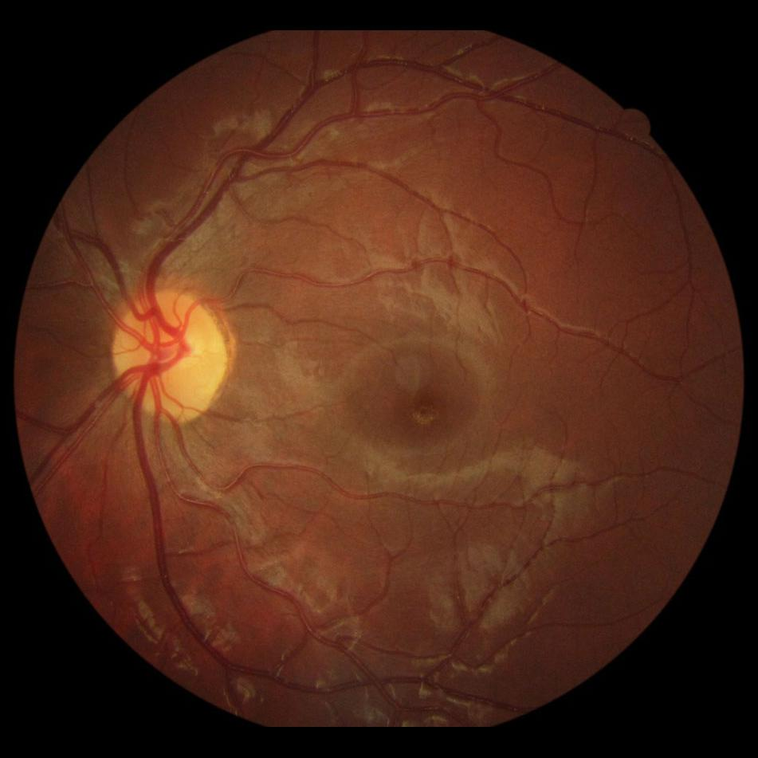
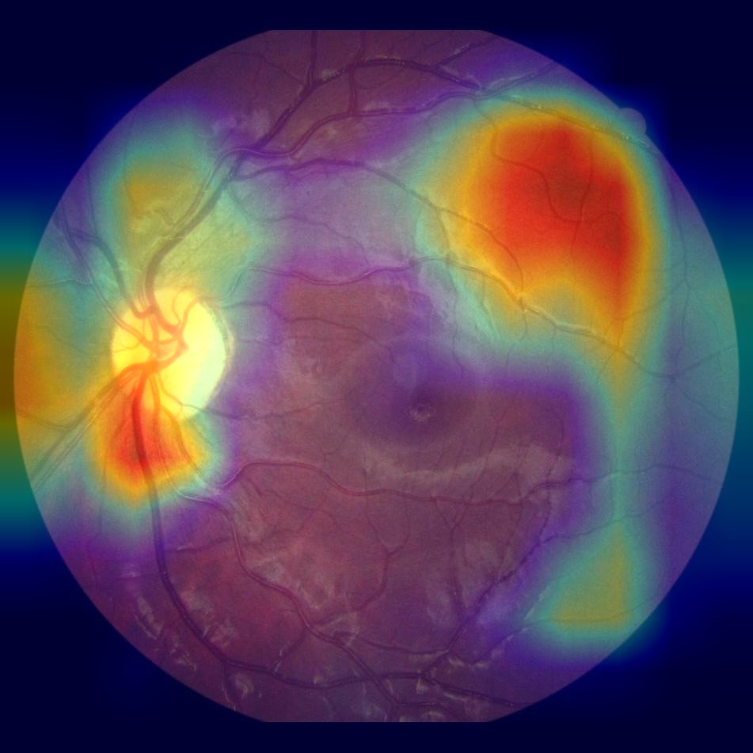
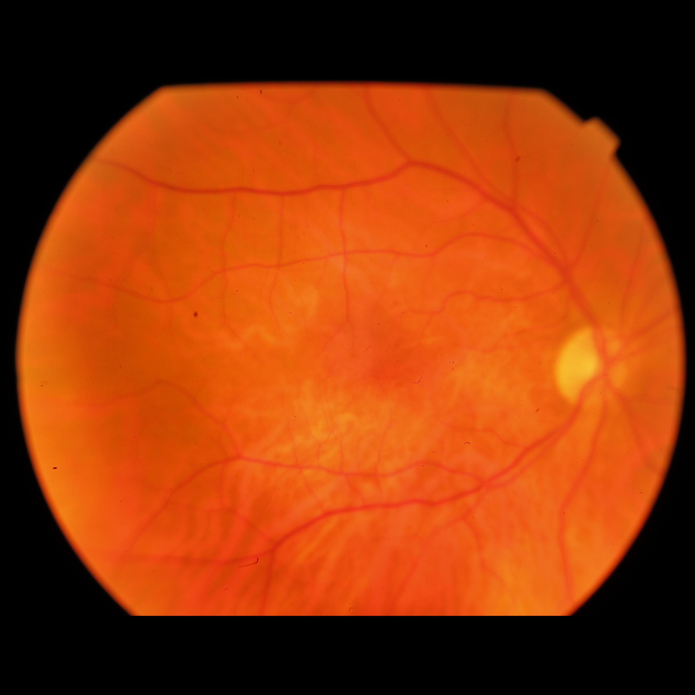
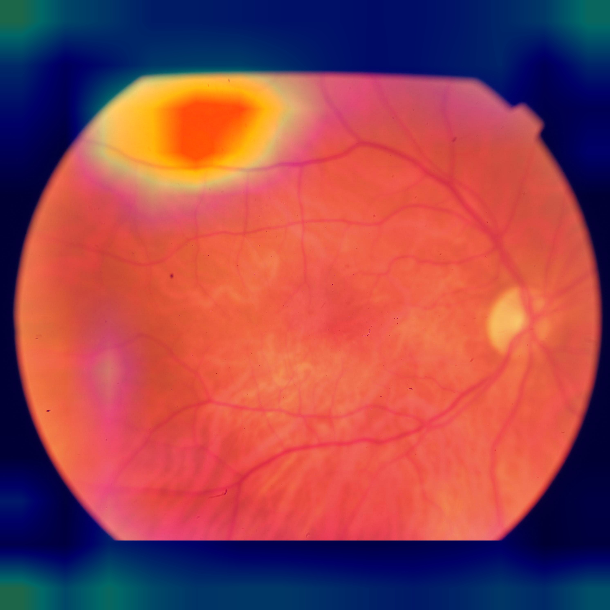
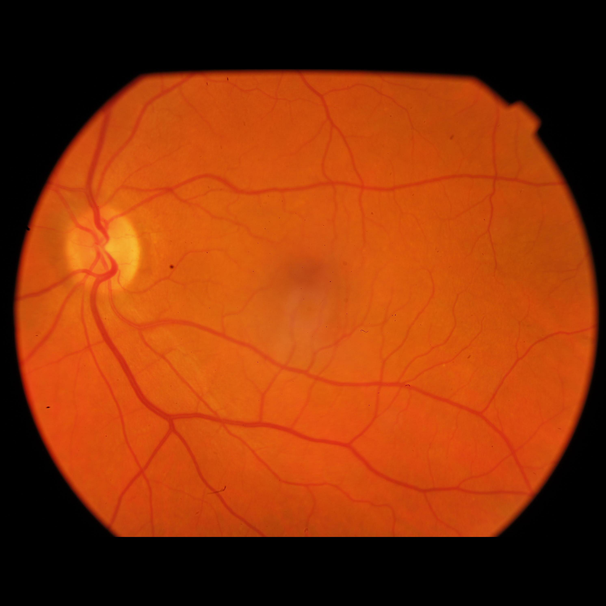
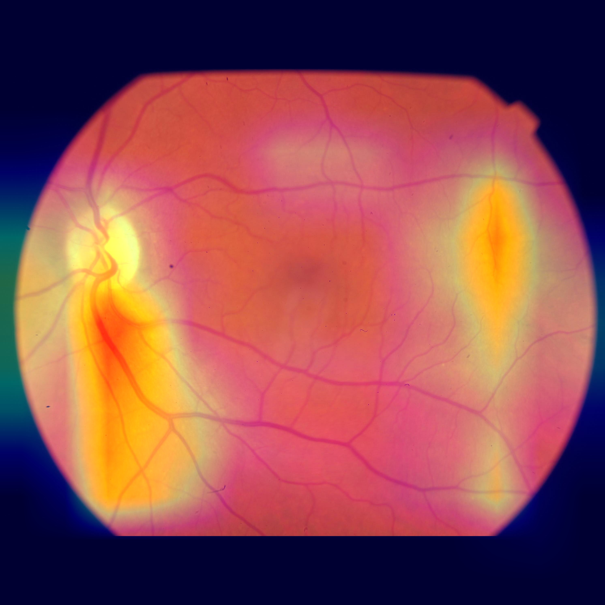
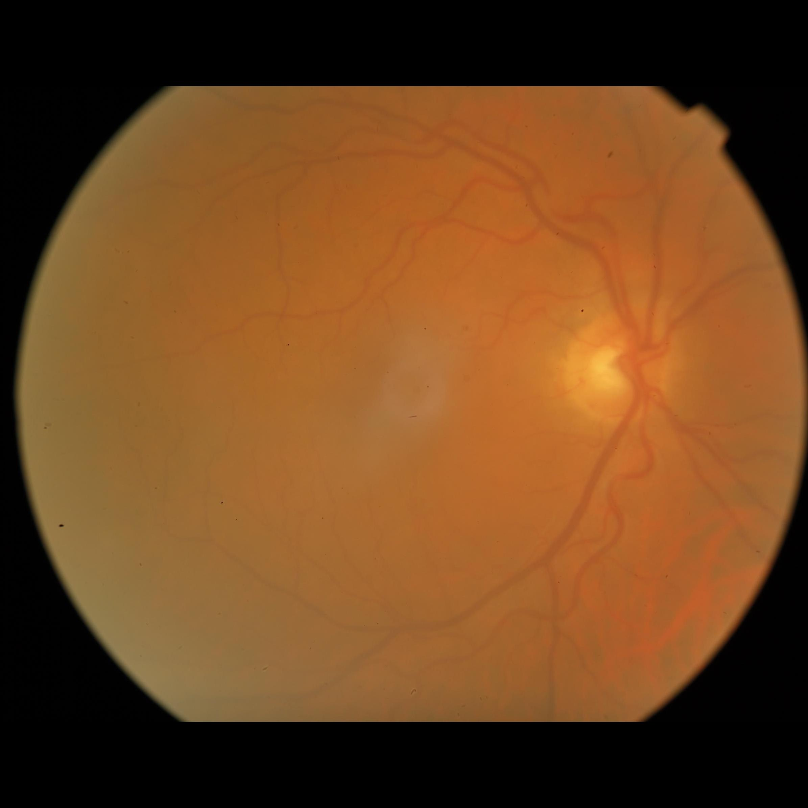
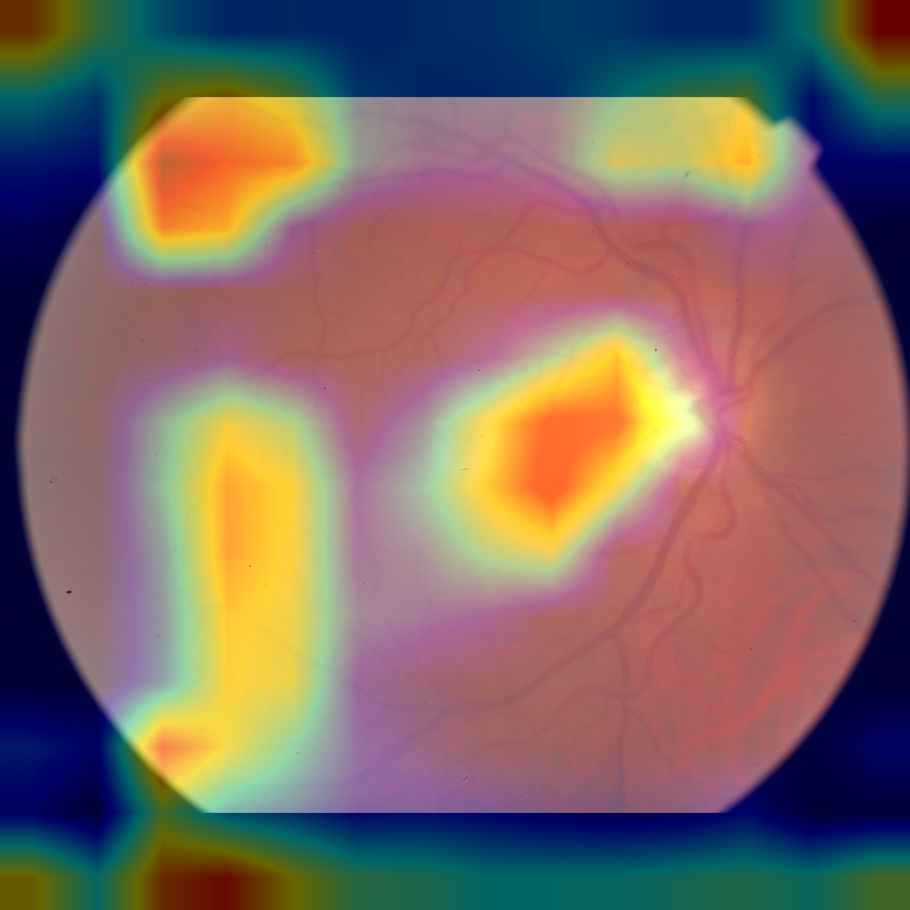

# CNN-Explainability-on-fundus-images-for-IQA

## Motivation
In previous works, we have developed a CNN-based classifier for Retinal Fundus images quality assessment, based on the BRSet[1] dataset. Recalling one of the biggest problems on this project, the dataset was fully unbalanced, with only $12$% of the images being classified as <i>Inadequate</i>, in quality terms, whilst all the other images were graded as <i>Adequate</i>. In order to get a decent classifier, we have explored two main hypothesis:

1. Pre-train a model using another Image Quality Assessment (IQA) dataset for retinal images, and fine tune it to BRSet;
2. Train a subset of BRSet, in order to keep it balanced, but use fewer data.

By deciding on training another dataset and fine tuning it to BRSet, we have chosen the EyeQ dataset[2]. The model on EyeQ, modified for two quality classes (based on the same criteria as BRSet) got up to $94$% accuracy, but it did not adjust well later for BRSet, during fine tuning phase. Results were not quite as good as just training a BRSet model, using some pre-trained CNNs.

Training only BRSet, based on ImageNet pre-trained CNNs were also not the best response, but it is where we got our best results. Using both ResNet50 and VGG16, we got up to $85$% accuracy. 

Noticing that the results seemed ok, but were not quite as good as we expected, it felt really important to know what our model was actually <i>looking</i> at, when making those predictions. Does the performance actually have something interesting, worth being analyzed, in order to improve the model general performance or influence further research? To do so, we have explored a famous algorithm for CNN explainability, described in the next session.

## GradCAM algorithm for explainability

GradCAM[3] is a recent interesting algorithm used for CNN explainability, mostly for images. The main idea of this algorithm, ignoring the math behind its work, is to implement a heatmap generator for the CNN activations on an image. With that said, given a trained model, you can actually run an image through the model and, before getting the final predictions (using the Softmax activation function), get the activations gradient for that input image.

Given the heatmap, you can adjust it and interpolate it through the input image, based on its original size (height $\times$ width) and generate a heatmap on the image. The final interpretation for the obtained image is that, the regions with the most activation from the CNN are going to be the most <i>heated</i> ones, meaning, the red regions.

The whole algorithm implementation and understanding may be checked on the original paper and online examples. The implementation file for BRSet may be found at src/utils/gradcam.py

## Results and a Quality criteria review

One of the quality criteria that was really hard to understand was <i>Image Field</i>. Fully defining it, according to the BRSet documentation, is: 

> **Image Field:** This parameter is graded as adequate when all the following requirements are met: 
> 1) The optic disc is at least 1 disc diameter (DD) from the nasal edge; 
> 2) The macular center is at least 2 DD from the temporal edge; 
> 3) The superior and inferior temporal arcades are visible in a length of at least 2 DD.

Notice that, this particular quality criteria is actually position-based, and not feature-based. That becomes more of a problem when dealing with basic CNNs for image classification, and even more with this criteria being the most common one on the dataset proposed. Following that, we can see some examples of the GradCAM application on the dataset, based on some of the quality criteria previously defined on the dataset:

1. Adequate Images

  
  

2. Focus problem

  
  

3. Image Field problem

  
  

4. Illumination problem

  
  

## Conclusions

With all that said, CNNs may not be the right approach to solve this problem, at least involving the BRSet dataset, that is the goal of our research. The biggest problem corcening the use of CNNs is that it may not be as good as describing features position on images, and since Image Field is the most common quality issue we are facing, our model may not perform as good as we wish. 

Another solution for this specific problem was proposed, and for now studies are being conducted towards the use of objects detection on images, in order to detect Optic Disc on retinal images. This may be lead into consideration on future studies and research projects.

## References:
[1] Physionet: Nakayama, L. F., Goncalves, M., Zago Ribeiro, L., Santos, H., Ferraz, D., Malerbi, F., Celi, L. A., & Regatieri, C. (2023). A Brazilian Multilabel Ophthalmological Dataset (BRSET) (version 1.0.0). PhysioNet. https://doi.org/10.13026/xcxw-8198.

[2] Huazhu Fu, Boyang Wang, Jianbing Shen, Shanshan Cui, Yanwu Xu, Jiang Liu, Ling Shao, "Evaluation of Retinal Image Quality Assessment Networks in Different Color-spaces", in MICCAI, 2019. [PDF] Note: The corrected accuracy score of MCF-Net is 0.8800.

[3] Ramprasaath R. Selvaraju, Michael Cogswell, Abhishek Das, Ramakrishna Vedantam, Devi Parikh, Dhruv Batra, "Grad-CAM: Visual Explanations from Deep Networks via Gradient-based Localization", Arxiv, 2019. Available at https://arxiv.org/abs/1610.02391

